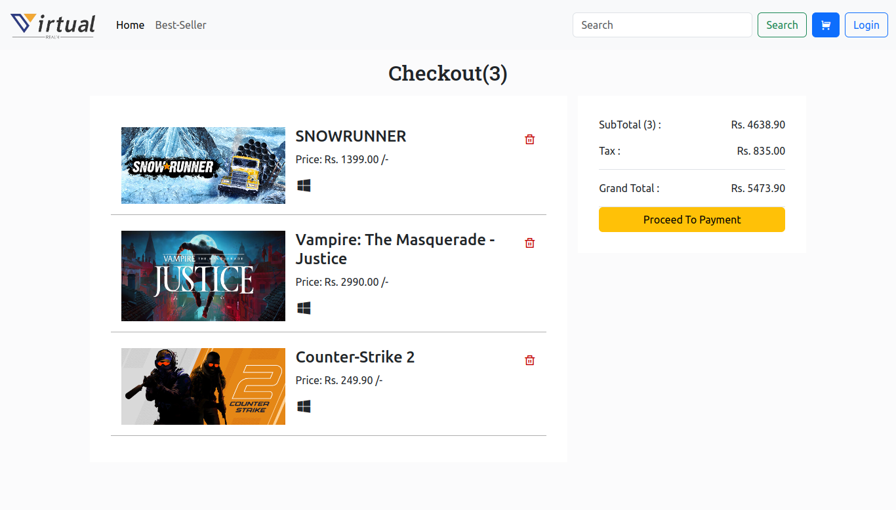
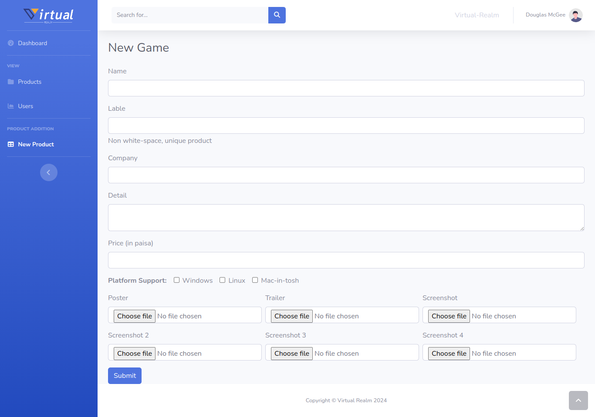

# Virtual Realm

Virtual Realm is an online game store that offers a wide range of games for purchase and play. It features seamless user registration, authentication, and payment processing, as well as an intuitive user interface for browsing and managing game purchases.

## Features

- **Dynamic Content**: Load data dynamically from the server using PHP, ensuring up-to-date information on available games, user accounts, and purchase history.
  
- **User Authentication**: Implement user authentication and authorization, allowing users to log in securely and access their account information, purchase history, and saved cart items.
  
- **Email Verification**: Utilize SMTP protocol and PHP Mailer to enable user registration with email verification, enhancing account security and preventing unauthorized access.
  
- **Cart Management**: Maintain a user-specific shopping cart that allows users to add and remove games before completing the purchase process.
  
- **Payment Gateway Integration**: Integrate PhonePe payment gateway to facilitate secure and convenient online payments for game purchases.

- **Admin Panel**: Provide an admin panel with dashboard metrics, including total products, user count, verified users, pending verifications, and graphical representations of monthly sales.
  
- **Sales Reporting**: Generate monthly sales reports with graphs and tables to track revenue trends and analyze performance over time.

- **Game Management**: Allow admin users to add, remove, and update game listings, ensuring the catalog remains up-to-date with the latest releases and promotions.

## Setup Instructions

1. Clone the repository to your local machine.
2. Set up a local development environment with PHP and a MySQL database (install xampp and put the folder in htdocs folder).
3. Import the provided database schema and sample data to populate the database.
4. Configure SMTP settings and PHP Mailer for email verification (By putting the email and SMTP password by editing singup/validate.php file).
5. Integrate PhonePe payment gateway credentials for payment processing (put the apikey and merchantId by editing php/payment.php file).
6. Start the local server and navigate to the project directory to launch the website.

## Usage

1. Visit the website and explore the available game catalog.
2. Create a new user account or log in with existing credentials.
3. Browse games, add them to your cart, and proceed to checkout.
4. Complete the payment process using PhonePe payment gateway.
5. Access your purchase library to download and play your purchased games.
6. Admin users can log in to the admin panel to manage products, view sales reports, and monitor user activity.

## Screenshots

*1. Homepage showcasing featured games*

*2. cart showcasing In-Cart games*

*3. library showcasing purchased games*

*4. Detailed Page*

*5. Login Page*

*6. Signup Page*

*7. Admin dashboard*

*8. List of Product*

*9. List of user*

*10. add product page*

*11. proceeds to Payment*

*12. proceeds to Payment*

### ER Diagram

## Contributing

Contributions are welcome! If you have any suggestions, enhancements, or bug fixes, please feel free to submit a pull request or open an issue.

---

